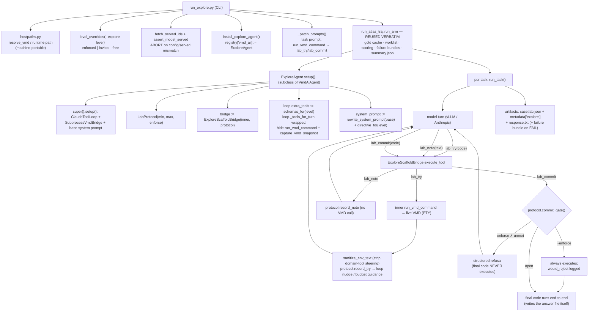

# Explore-arm implementation map

One page: how the knowledge-free self-exploration arm is wired, where every mechanism
lives, and what it guarantees. Companion to README.md (how to run it).

## 1. Runtime call flow

## 2. File map (all new code; zero existing files modified)

| file | role | depends on |
|---|---|---|
| `scaffold.py` | PURE logic: `EXPLORE_DIRECTIVE` / `INVITE_DIRECTIVE`, framed + neutral schemas, `directive_for` / `schemas_for`, `FORBIDDEN_TOKENS` lint, `rewrite_system_prompt`, `sanitize_env_text`, **`LabProtocol`** (gate, loop-nudge, soft budget, would_reject, event log) | stdlib only |
| `explore_bridge.py` | `ExploreScaffoldBridge` — decorator over any VMD bridge; routes `lab_*`, enforces the gate at tool dispatch, aliases stray `run_vmd_command` to `lab_try`, attaches `tcl` to results | scaffold |
| `explore_agent.py` | `ExploreAgent(VmdAiAgent)` — wraps bridge, swaps tool surface, appends directive, writes `<case>.lab.json` + `metadata["explore"]` | vmd_ai_agent, scaffold, bridge |
| `hostpaths.py` | machine-aware VMD + runtime resolution (env → config → known Mac/tbgl paths) | stdlib |
| `run_explore.py` | CLI: config prep (`_prepare_config`), `level_overrides`, served-model guard, registry swap, prompt retarget, delegate to `run_atlas_traj.run_arm` | all above + run_atlas_traj |
| `config_explore*.json` | per-model portable configs (no machine paths; `explore_*` knobs) | — |
| `tests/` (59) | gate machine, lint, ladder, wiring (fake bridge + real loop), live-VMD, host paths, runner glue | — |

## 3. The elicitation ladder (one knob pair)

| level (`--explore-level`) | tool schemas | directive | commit gate | measures |
|---|---|---|---|---|
| `free` | neutral (no framing) | none | off (`would_reject` logged per commit) | SPONTANEOUS exploration |
| `invited` | framed (errors-are-information) | `INVITE_DIRECTIVE` (advice; no MUST/reject language — test-asserted) | off (logged) | advice effect |
| `enforced` | framed | `EXPLORE_DIRECTIVE` (4 phases + rejection warning) | ON: ≥min experiments ∧ ≥1 note ∧ re-run after last note | enforcement effect |

Knobs: `explore_enforce` (bool), `explore_directive` (`full|invite|none`),
`explore_min_experiments` (3), `explore_max_experiments` (15, soft — warn, never block).

## 4. Guarantees (each backed by a test)

- **Knowledge-free**: `lint_texts()` = ∅ over ALL scaffold-authored strings (both
  directives + both schema sets) against `FORBIDDEN_TOKENS` (VMD commands, MD terms).
  The one shared-bridge leak (anti-thrash text advertising `vmd_traj_measure`) is
  stripped by `sanitize_env_text`.
- **Comparability**: same cards, gold, tolerances, scoring, and serving as every other
  arm; the ONLY prompt change is the tool-name retarget (string-replace, auditable).
- **Provenance**: `assert_model_served` aborts before task 1 on a config/served
  mismatch; banners record model + VMD paths; `lab.json` records every action.
- **No deadlock**: soft budget warns; the gate's three conditions are always satisfiable;
  unenforced levels never block.
- **Isolation**: decorator + subclass + registry swap + module-attr prompt patch —
  `runtime/`, `vmdbench/`, and `scivisagentbench/` untouched.

## 5. Per-task artifacts

- `<case>.txt` — the answer file (written by the model's final code; scored vs gold)
- `<case>.lab.json` — full protocol record: events (try/note/commit/commit_check with
  code, ok, error, guidance), counters: `experiments, notes, errors, error_recoveries,
  commit_rejections, would_reject_commits, commits, loop_nudges, cap_warnings, enforce`
- `<case>.response.txt` — the model's final text
- `failures/<case>.{tcl,log}` + `failures.jsonl` — on scored FAIL (harness-standard)
- `summary.json` — per-run official verdicts (the completion marker)
